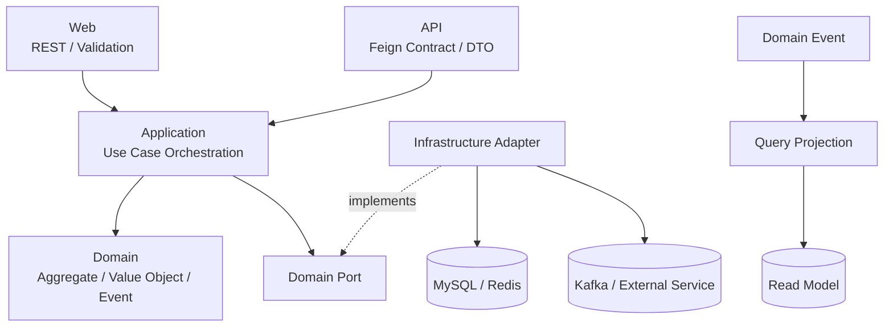
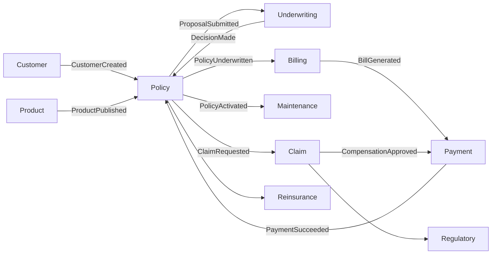
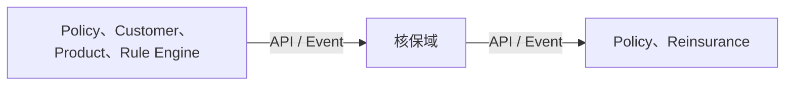

<div align="center">

# Titanium 保险核心系统

**面向多险种、全生命周期和多租户场景的 DDD + CQRS + 事件驱动保险核心平台**

[](https://openjdk.org/projects/jdk/21/)
[](https://spring.io/projects/spring-boot)
[](https://www.axoniq.io/)
[](https://kafka.apache.org/)
[](https://github.com/chisss/titanium)

[系统全景](#titanium-是什么) · [服务索引](#微服务索引) · [架构边界](#架构与领域边界) · [当前服务](#titanium-underwriting) · [快速开始](#快速开始)

</div>

## 微服务索引

> 下面全部使用 GitHub 绝对链接。从任何 Titanium 仓库进入，都可以直接跳转到目标服务。

| 业务分组 | 服务 |
|---|---|
| 平台与运营 | [管理后台服务 `titanium-admin`](https://github.com/chisss/titanium-admin) · [功能中心域 `titanium-feature-center`](https://github.com/chisss/titanium-feature-center) |
| 交易与履约 | [计费域 `titanium-billing`](https://github.com/chisss/titanium-billing) · [理赔域 `titanium-claim`](https://github.com/chisss/titanium-claim) · [投资域 `titanium-investment`](https://github.com/chisss/titanium-investment) · [保全域 `titanium-maintenance`](https://github.com/chisss/titanium-maintenance) · [支付域 `titanium-payment`](https://github.com/chisss/titanium-payment) |
| 生态支撑 | [渠道域 `titanium-channel`](https://github.com/chisss/titanium-channel) · [文档域 `titanium-document`](https://github.com/chisss/titanium-document) · [通知域 `titanium-notification`](https://github.com/chisss/titanium-notification) |
| 产品与承保 | [条款域 `titanium-clause`](https://github.com/chisss/titanium-clause) · [保单域 `titanium-policy`](https://github.com/chisss/titanium) · [产品域 `titanium-product`](https://github.com/chisss/titanium-product) · **[核保域 `titanium-underwriting`](https://github.com/chisss/titanium-underwriting)** |
| 客户与交易 | [客户域 `titanium-customer`](https://github.com/chisss/titanium-customer) |
| 治理与风控 | [监管域 `titanium-regulatory`](https://github.com/chisss/titanium-regulatory) · [再保险域 `titanium-reinsurance`](https://github.com/chisss/titanium-reinsurance) · [规则引擎域 `titanium-rule-engine`](https://github.com/chisss/titanium-rule-engine) |

<details>
<summary><strong>共享组件、前端与工程仓库</strong></summary>

| 类型 | 仓库 | 用途 |
|---|---|---|
| [运营管理前端](https://github.com/chisss/titanium-admin-web) | `titanium-admin-web` | Vue 3 管理工作台 |
| [共享基础库](https://github.com/chisss/titanium-common) | `titanium-common` | 多租户、通用响应、异常与基础能力 |
| [业务元数据](https://github.com/chisss/titanium-metadata) | `titanium-metadata` | 跨域枚举、值语义与元数据契约 |
| [依赖基线](https://github.com/chisss/titanium-parent) | `titanium-parent` | Maven BOM、插件与版本治理 |
| [构建规则](https://github.com/chisss/titanium-build-tools) | `titanium-build-tools` | 架构和代码质量检查 |
| [系统测试](https://github.com/chisss/titanium-test) | `titanium-test` | 跨服务集成与端到端验收 |

</details>

## Titanium 是什么

Titanium 是保险核心业务平台，围绕保险产品从定义、投保、核保、签发、收费，到保全、理赔、再保和监管的完整生命周期建设。系统以限界上下文拆分业务能力，让每个服务拥有自己的领域模型、数据和发布节奏，并通过稳定 API 与领域事件协作。

### 设计目标

- **全险种**：支持车险、寿险、健康险、宠物险，以及投连险、万能险等账户型产品。
- **全生命周期**：覆盖产品、销售、承保、收费、保全、理赔、投资、再保和监管链路。
- **多租户**：请求、命令、事件、读模型和持久化数据均携带租户上下文。
- **可演进**：服务内部坚持 DDD 分层，服务之间通过契约和事件解耦。
- **可审计**：关键业务决定保存版本、输入摘要、业务证据与操作轨迹。

## 技术栈

| 领域 | 技术 | 用途 |
|---|---|---|
| 语言与构建 | Java 21、Maven | Record、虚拟线程、统一依赖与构建生命周期 |
| 应用框架 | Spring Boot 4.0.1、Spring Cloud OpenFeign | Web 应用、依赖注入、服务间同步契约 |
| 领域与消息 | Axon Framework 4.10、Apache Kafka 4.0 | CQRS、领域事件、异步跨域协作 |
| 数据与缓存 | MySQL 8、Redis 7.2 | 事务数据、读模型、缓存与幂等辅助 |
| 数据迁移 | Liquibase 4.26 | 数据库结构版本化 |
| 工程效率 | Lombok、MapStruct | 构造注入、日志、跨层对象映射 |
| 交付运行 | Docker、Docker Compose | 本地依赖、集成环境和容器化运行 |

> 各服务按自身边界选择依赖；例如后台 CRUD 服务不强制使用 Axon，纯共享组件也不会引入 Web 运行时。

## 架构与领域边界

### 服务内部：DDD + 六边形分层



- Web 只处理协议、鉴权、校验和响应；Application 只编排用例。
- 业务不变量进入聚合根或纯领域服务，Domain 不依赖 Spring 基础设施。
- 远程调用和消息发送由 Domain 定义 Port，Infrastructure 提供 Adapter。
- 写侧发布事实，Query 维护读模型；跨域不共享数据库表和内部实体。

### 服务之间：事件驱动协作



### 边界规则

1. 聚合只能在所属服务内修改；其他服务通过 API 查询或以命令/事件发起协作。
2. 事件描述已经发生的业务事实，必须带有 `tenantId`、业务标识和必要快照，避免消费者反查写库。
3. 同步调用用于必须即时获得的判定；跨生命周期状态推进优先使用事件并保证幂等。
4. `titanium-metadata` 只承载稳定的跨域语义；服务专属枚举和值对象留在本域。
5. 仓储和远程 Port 由 Domain 定义，Adapter 位于 Infrastructure；Domain Service 不依赖任何 Port。

---

## titanium-underwriting

> **核保域**：负责风险资料采集、自动规则评估、人工审核、附加条件和最终核保结论。

| 属性 | 内容 |
|---|---|
| 限界上下文 | 核保域（核心域） |
| 核心模型 | UnderwritingCase、RiskAssessment、Decision |
| 主要上游 | Policy、Customer、Product、Rule Engine |
| 主要下游 | Policy、Reinsurance |
| 默认地址 | [`http://localhost:8083`](http://localhost:8083) |
| GitHub | [`titanium-underwriting`](https://github.com/chisss/titanium-underwriting) |

### 能力与边界

| 本服务负责 | 本服务不负责 |
|---|---|
| 核保案件与风险快照<br/>自动和人工核保流程<br/>加费、除外及延期条件<br/>版本化核保决定和证据 | 保单签发和生效<br/>产品规则定义<br/>客户主数据维护 |

### 核心能力

- 核保案件与风险快照
- 自动和人工核保流程
- 加费、除外及延期条件
- 版本化核保决定和证据

### 协作关系



跨域调用必须透传 `X-Tenant-Id`；命令、事件和持久化模型必须保留 `tenantId`。服务间只依赖 `api` 契约或公开事件，不依赖对方的 Domain、Infrastructure 或数据库。

### 模块结构

| 模块 | 职责 |
|---|---|
| `titanium-underwriting-common` | 通用层：模块内枚举、异常和常量 |
| `titanium-underwriting-api` | API 层：服务间契约、Feign 接口和 DTO |
| `titanium-underwriting-domain` | 领域层：聚合、值对象、领域事件及 Port |
| `titanium-underwriting-application` | 应用层：用例编排、命令与查询协调 |
| `titanium-underwriting-infrastructure` | 基础设施层：Repository、远程 Adapter、消息与持久化 |
| `titanium-underwriting-query` | 查询层：CQRS 读模型与查询处理器 |
| `titanium-underwriting-web` | Web 层：REST 入口、请求校验和响应装配 |
| `titanium-underwriting-bootstrap` | 启动层：Spring Boot 入口、配置和 Liquibase |

## 快速开始

### 环境要求

- JDK 21
- Maven 3.9+
- MySQL 8.0+
- Redis 7.2+、Kafka 4.0（按本服务配置启用）

### 构建与测试

```bash
git clone https://github.com/chisss/titanium-underwriting.git
cd titanium-underwriting
mvn clean verify
```

### 本地启动

```bash
mvn -pl titanium-underwriting-bootstrap -am spring-boot:run
```

默认访问地址为 `http://localhost:8083`。数据库、Redis、Kafka、下游服务地址及环境变量以 `titanium-underwriting-bootstrap/src/main/resources/application.yml` 为准。

## 接口与开发约定

- 面向前端的接口放在 `web`，服务间接口和 DTO 放在 `api`。
- Controller 使用 `@Validated` 与 JSR-303；Application 采用构造器注入。
- 跨层转换使用 MapStruct，不直接暴露持久化对象。
- 日志使用 SLF4J 占位符，不记录身份证件、Token 等敏感数据。
- 新增业务行为时优先补充聚合测试；跨域流程补充集成或契约测试。

## 相关资料

- [详细设计](./DESIGN.md)
- [Titanium 主仓库](https://github.com/chisss/titanium)
- [全部服务与组件](https://github.com/chisss?tab=repositories&q=titanium)
- [Axon Framework 文档](https://docs.axoniq.io/axon-framework-reference/4.10/)
- [Spring Boot 文档](https://docs.spring.io/spring-boot/)

---

<div align="center">

**Titanium Insurance Core** · Domain-driven, event-aware, tenant-safe.

[返回顶部](#titanium-保险核心系统) · [切换服务](#微服务索引)

</div>
